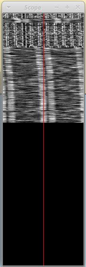
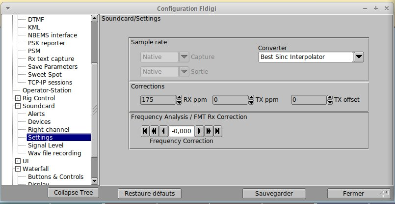
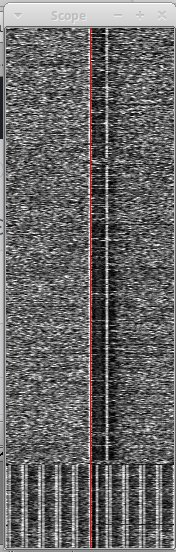

**Calibrage de la carte son sous Fldigi**
==========================================

Si vous possedez un poste un peu ancien, laissez le chauffer 30mn pour vous
assurer qu'il a atteint sa stabilité en fréquence optimale.

Pour ne pas avoir de problème d'alignement vertical lors de la recep d'images,
Il est nécessaire d'entrer un facteur de correction de la fréquence d'horloge 
de la carte son.

Pour ce faire, vous allez utiliser RWM, la station russe (4996kHz, 9996kHz, 14996kHz).
RWM emet divers type de signaux comme suit : 
- Entre 0 et 8mn après l'heure, RWM transmet une porteuse non modulée.
- A 9mn, RWM transmet son indicatif en morse. 
- Entre 10 et 20mn, RWM transmet une pulsation à 1Hz.
- Entre 20 et 30mn, RWM transmet une pulsation à 10Hz.
Ce schéma se répète toutes les 30mn.
Les transmissions qui nous intéressent sun les pulse à 1Hz et 10Hz.

Callez votre recepteur en USB sur l'une de ces fréquences moins 1kHz (eg: 9995kHz).
Dans fldigi, configurez le mode sur WWV et votre offset à 1000 puis cliquez sur le menu Vue/scope flottant.
Agrandissez la fenêtre de ce dernier vers le bas pour bénéficier d'un enregistremet assez long du signal.

Cliquez avec le bouton gauche pour centrer le signal voulu et cliquez avec le bouton droit pour zoomer (+-).

Ouvrez le menu de config, puis allez sur Soundcard/Settings.

Menu de configuration de la carte son.

Si le signal dérive vers la droite, augmentez la valeur RX ppm (à 50 ou 100ppm).
S'il dérive à gauche diminuez le.
Vous pouvez dégrossir la correction assez rapidement, re-calez le signal si besoin et affinez le
réglage en laissant le signal s'enregisttrer un peu plus longtemps.

Signal de 1Hz puis de 10Hz.

Une fois que le signal ne diminue plus, enrgistrez votre réglage.

